# Flow Diagrams

This document contains flow diagrams showing business logic, decision trees, and data transformation pipelines.

## 1. User Authentication Decision Flow

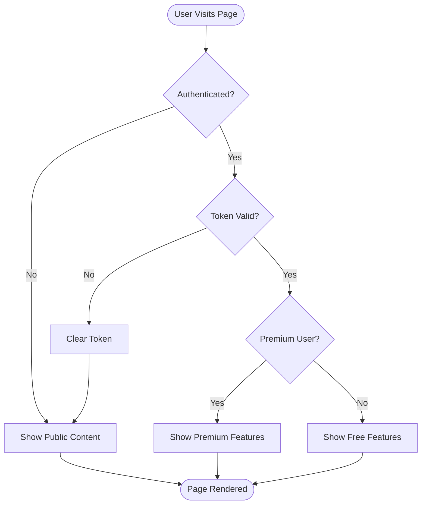

## 2. Progress Update Logic Flow

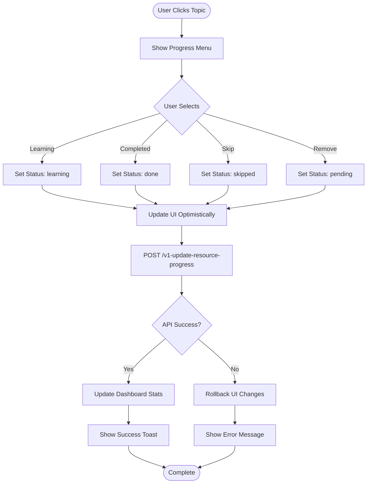

## 3. AI Feature Rate Limiting Flow

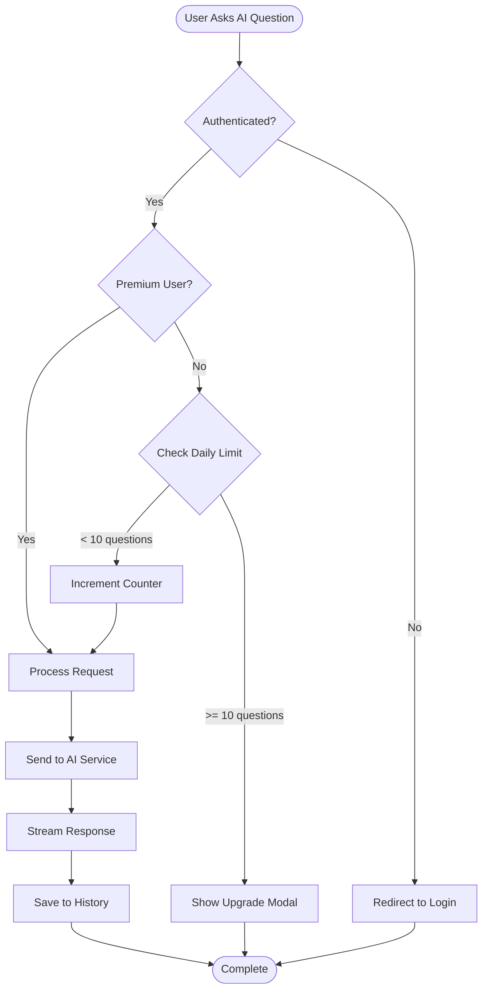

## 4. Content Rendering Pipeline

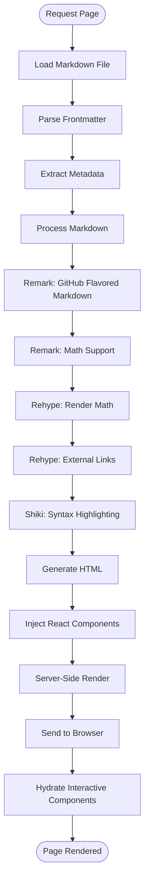

## 5. Team Member Invitation Flow

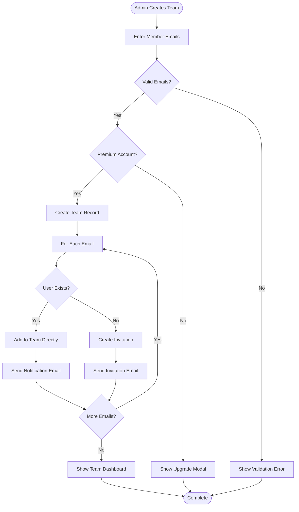

## 6. Roadmap Generation Decision Tree

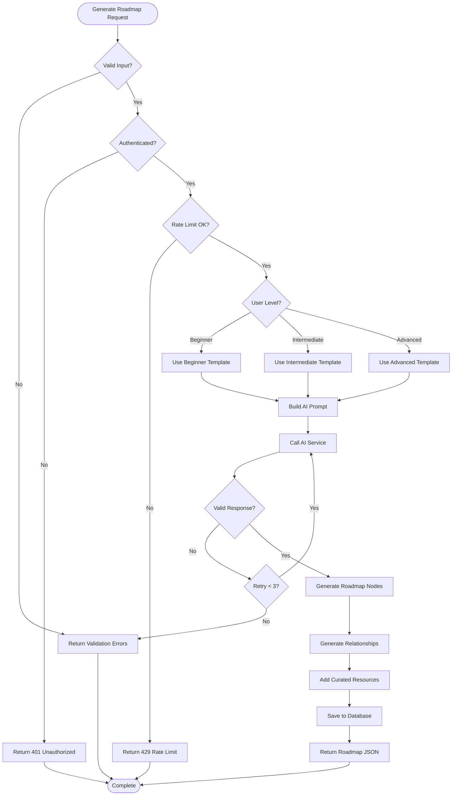

## 7. Content Contribution Approval Flow

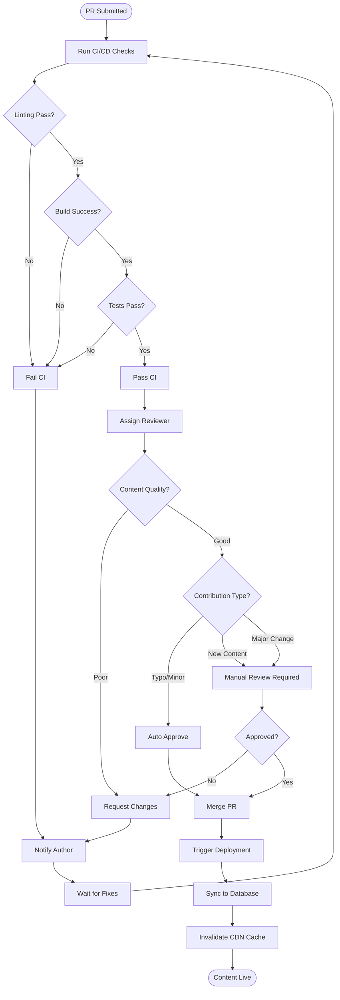

## 8. Project Difficulty Recommendation

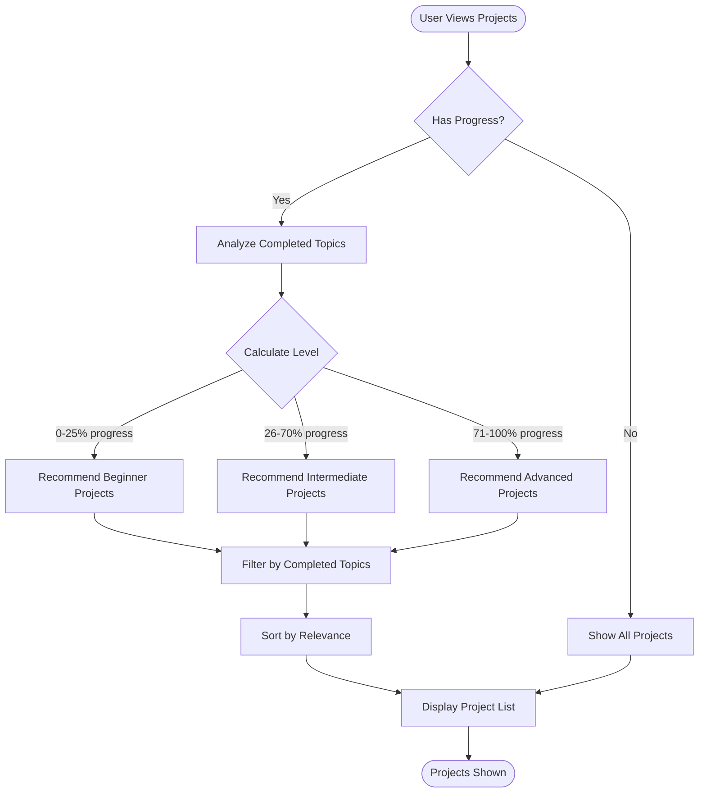

## 9. Deployment Pipeline

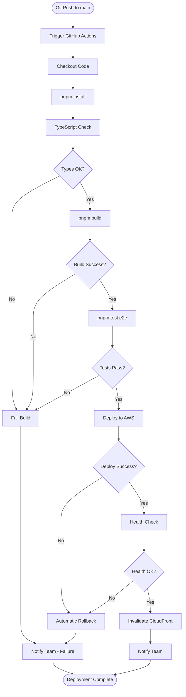

## 10. User Onboarding Flow

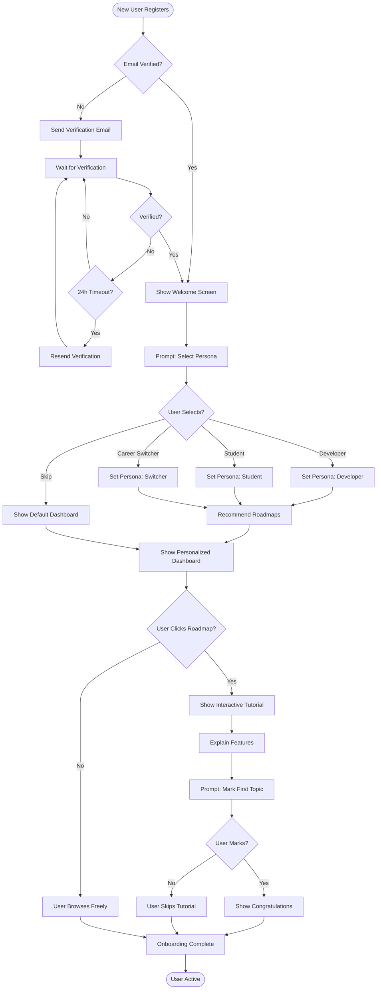

## 11. Search and Indexing Flow

```mermaid
flowchart TD
    Start([Build Process]) --> GatherContent[Gather All Content]
    
    GatherContent --> ParseRoadmaps[Parse Roadmap Files]
    ParseRoadmaps --> ParseGuides[Parse Guide Files]
    ParseGuides --> ParseBestPractices[Parse Best Practices]
    ParseBestPractices --> ParseProjects[Parse Projects]
    
    ParseProjects --> BuildIndex[Build Search Index]
    BuildIndex --> TokenizeText[Tokenize Text]
    TokenizeText --> RemoveStopWords[Remove Stop Words]
    RemoveStopWords --> StemWords[Stem Words]
    
    StemWords --> CreateInvertedIndex[Create Inverted Index]
    CreateInvertedIndex --> CalculateScores[Calculate TF-IDF Scores]
    
    CalculateScores --> SerializeIndex[Serialize Index to JSON]
    SerializeIndex --> CompressIndex[Compress Index]
    
    CompressIndex --> BundleWithApp[Bundle with Application]
    BundleWithApp --> DeployIndex[Deploy to CDN]
    
    DeployIndex --> RuntimeSearch[Runtime: User Searches]
    RuntimeSearch --> LoadIndex[Load Index in Browser]
    
    LoadIndex --> QueryIndex[Query Index]
    QueryIndex --> RankResults[Rank Results by Score]
    RankResults --> DisplayResults[Display to User]
    
    DisplayResults --> End([Search Complete])
```

## 12. Error Handling and Retry Logic

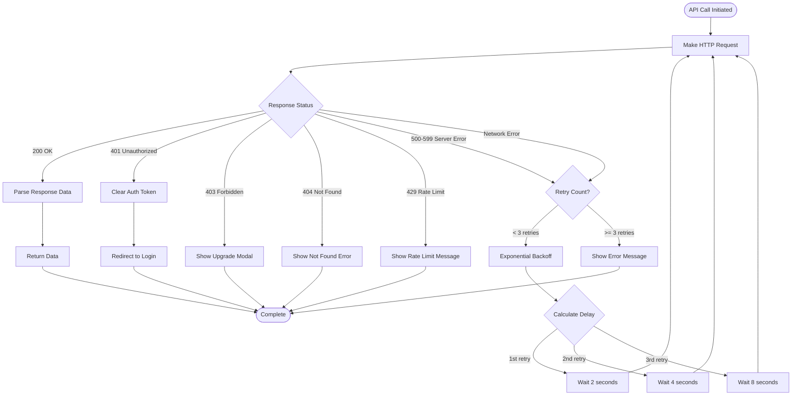

## 13. Progressive Web App Update Flow

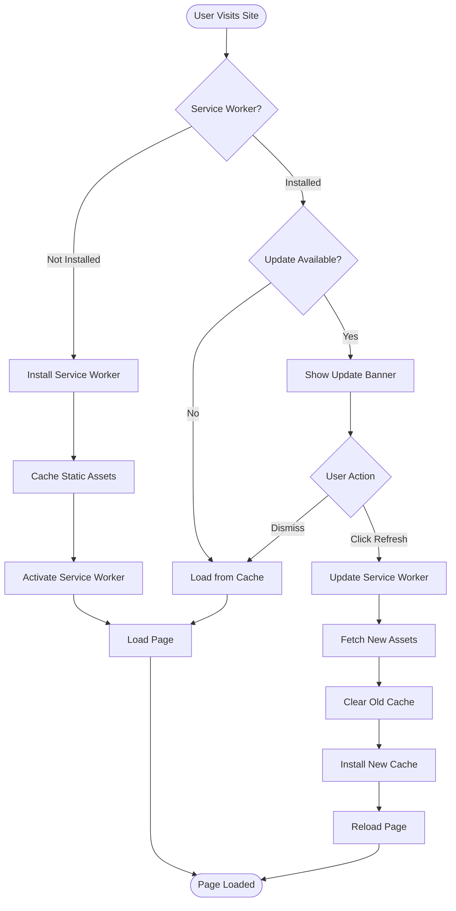

---

For sequence diagrams, see [Sequence Diagrams](./sequence-diagrams.md).

For architecture details, see [Architect Guide](../personas/architect-guide.md).
