# Sequence Diagrams

This document contains sequence diagrams showing the interaction flows in the roadmap.sh application.

## 1. User Registration Flow

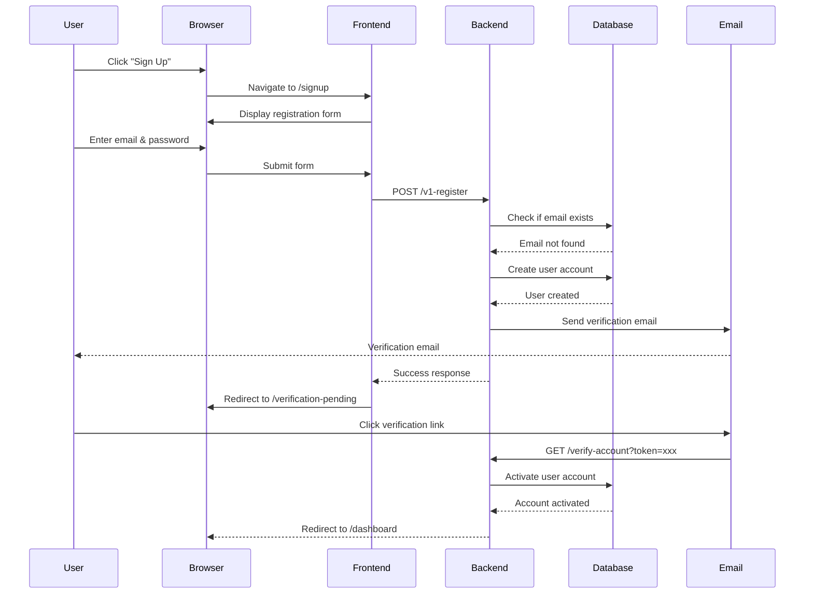

## 2. OAuth Login Flow (Google)

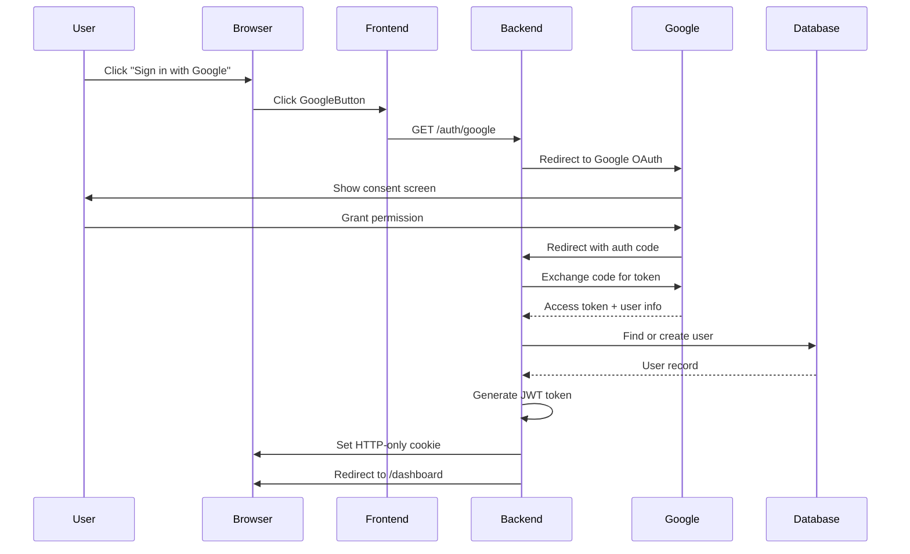

## 3. Roadmap Viewing Flow

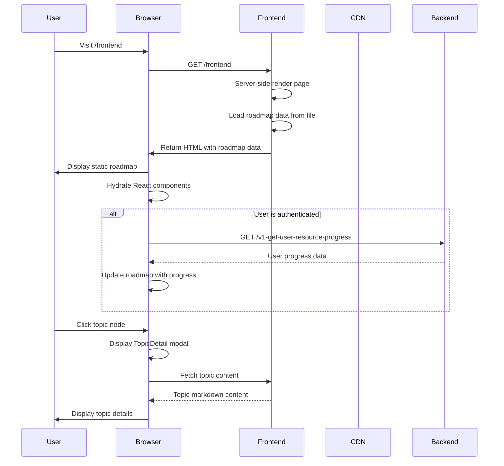

## 4. Progress Tracking Flow

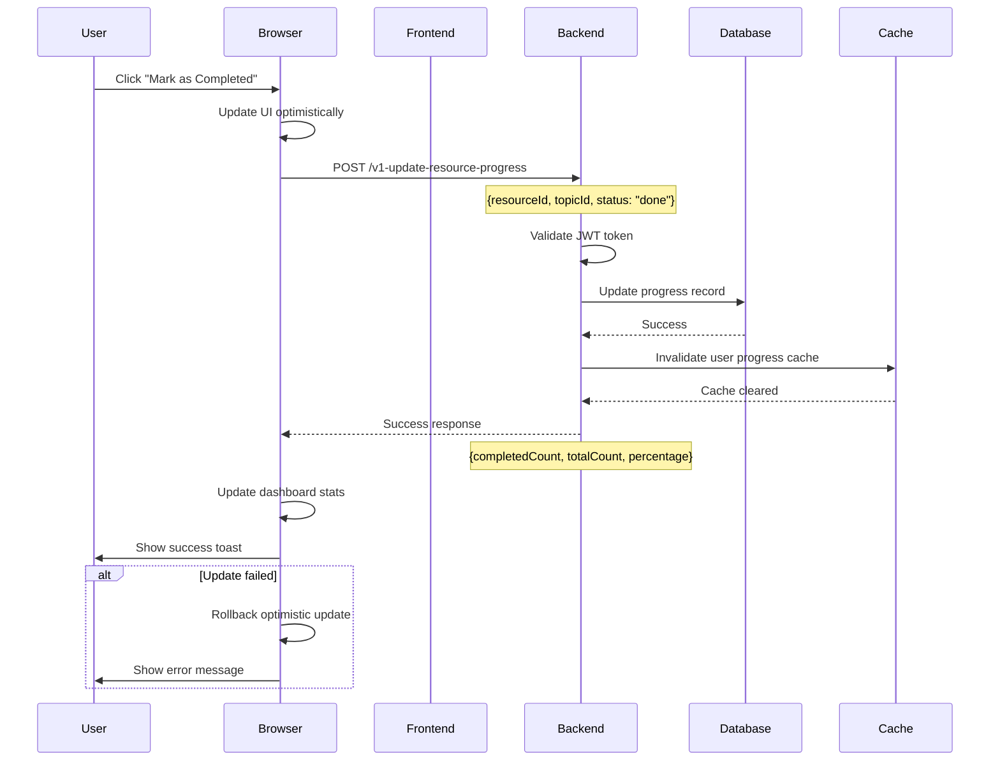

## 5. AI Chat Flow (Streaming)

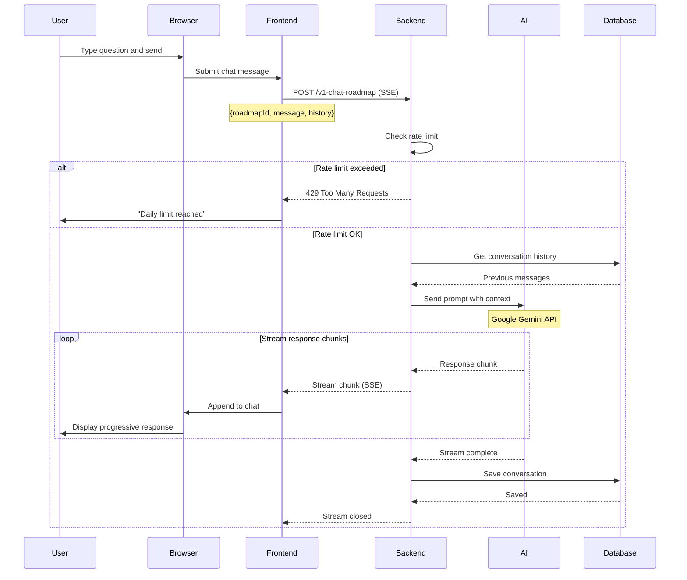

## 6. AI Roadmap Generation Flow

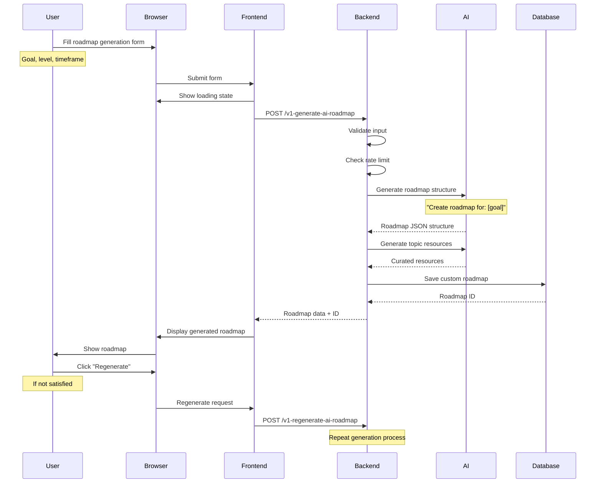

## 7. Team Creation and Invitation Flow

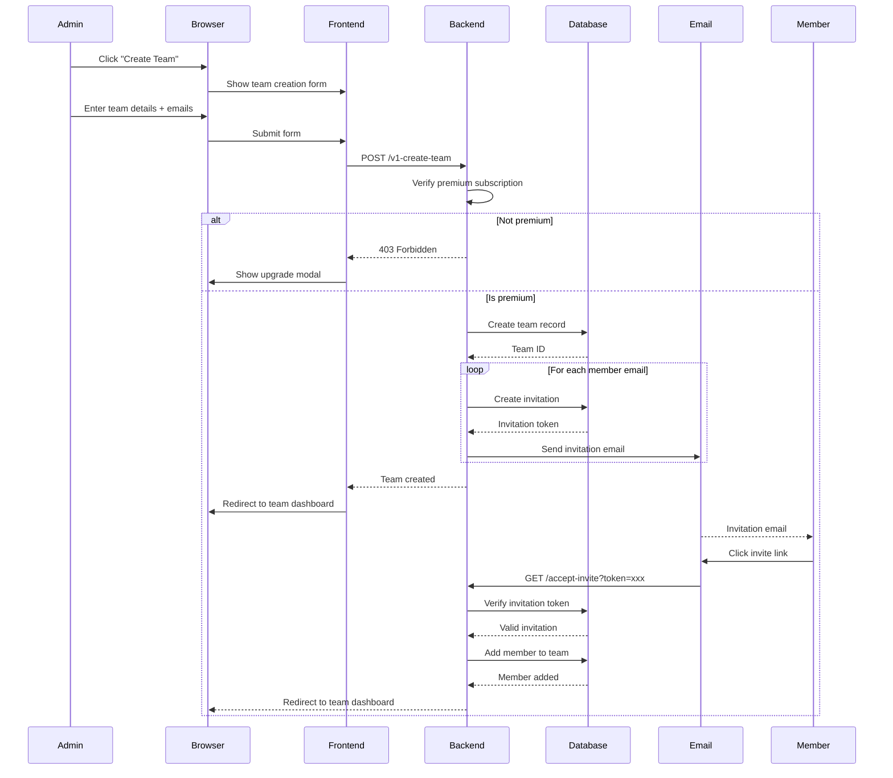

## 8. Project Submission Flow

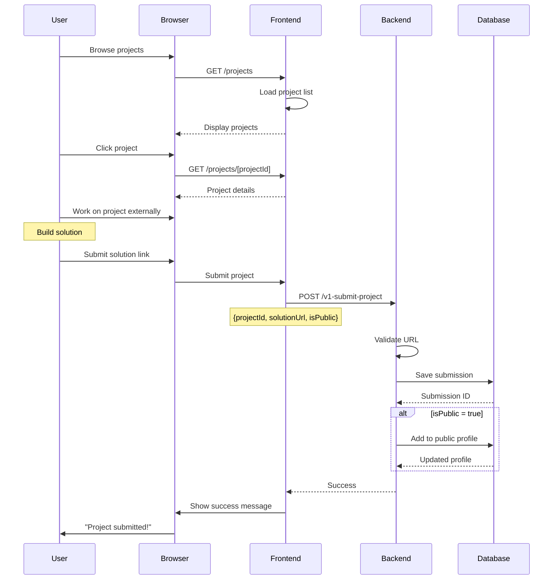

## 9. Content Contribution Flow

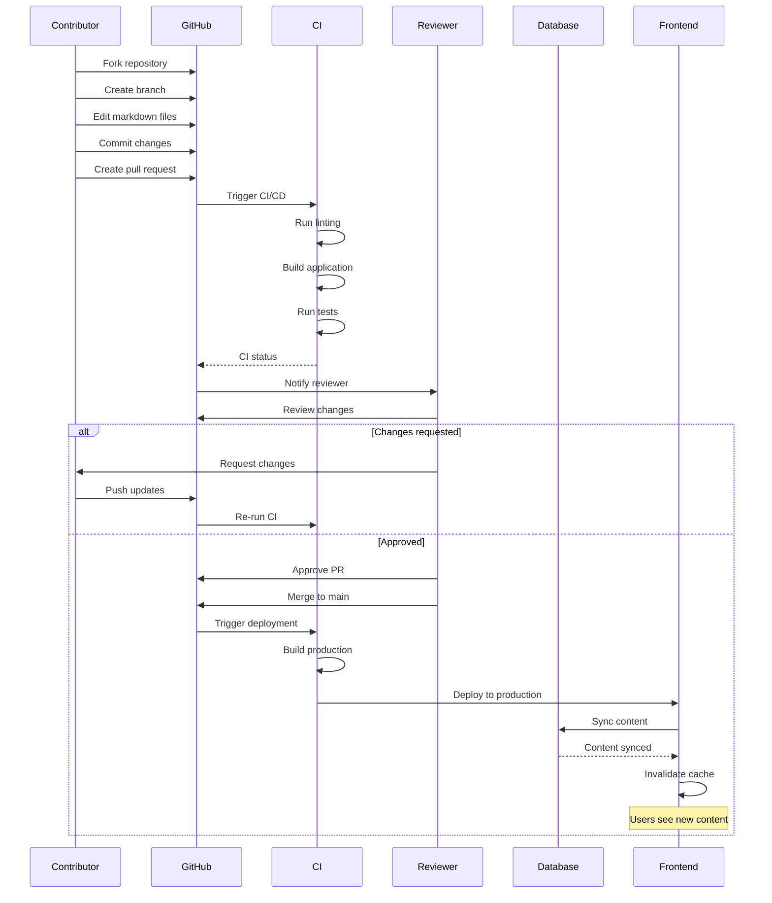

## 10. Payment Flow (Premium Subscription)

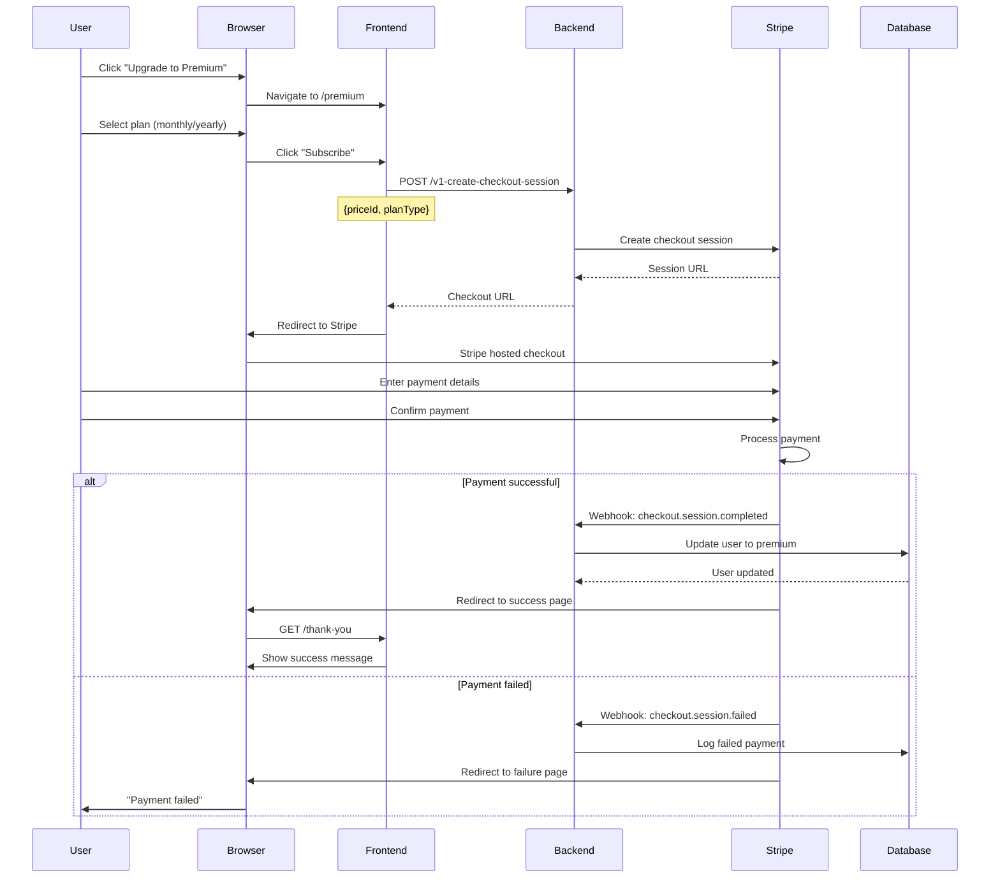

## 11. Public Profile Viewing Flow

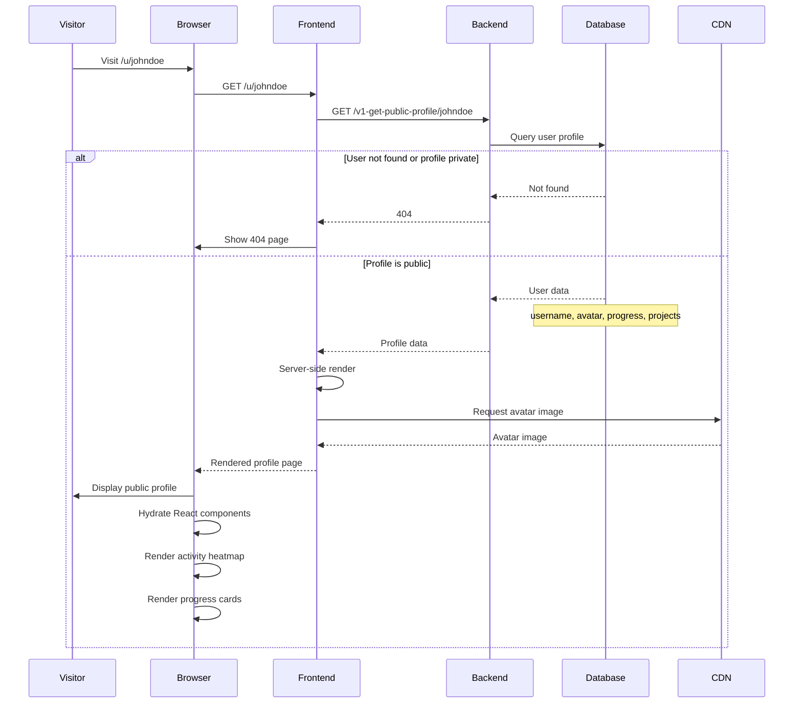

## 12. Search and Discovery Flow

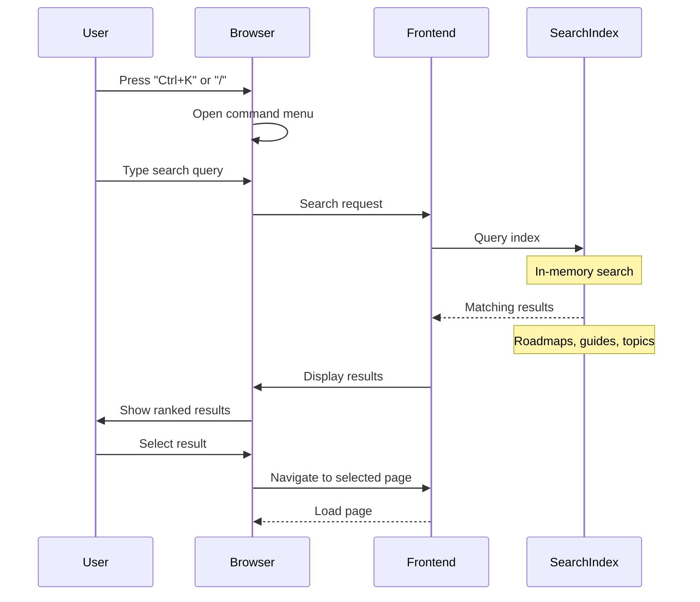

---

For flow diagrams, see [Flow Diagrams](./flow-diagrams.md).

For architecture details, see [Architect Guide](../personas/architect-guide.md).
