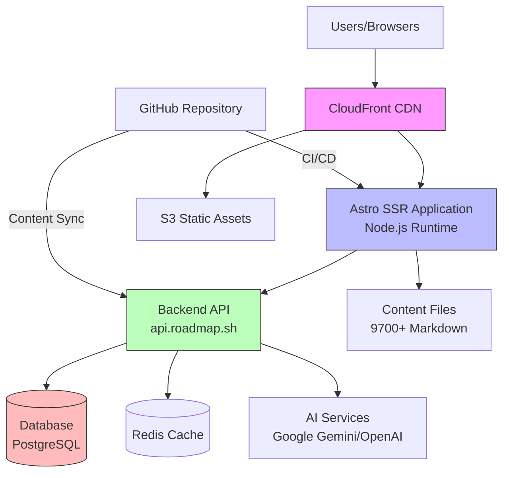

# Architect Guide

## Executive Summary

roadmap.sh is a large-scale educational platform serving millions of developers worldwide. The system is built using modern web technologies with a focus on performance, scalability, and maintainability.

### System Purpose

Provide free, interactive learning roadmaps and resources to help developers navigate their learning journey across 100+ technologies and career paths.

### Key Capabilities

- Interactive, node-based roadmap visualization
- AI-powered personalized learning assistance
- Progress tracking and analytics
- Team collaboration features
- Community-driven content management
- 9,700+ curated educational resources

### Technology Decisions

- **Astro + React**: Best-of-both-worlds approach (SSR performance + client-side interactivity)
- **TypeScript**: Type safety across the entire codebase
- **File-based Content**: Simple, version-controlled content management
- **AWS Infrastructure**: Proven scalability and reliability
- **Islands Architecture**: Selective hydration for optimal performance

## System Architecture

### Architectural Overview



### Component Architecture

#### Frontend Layer (This Repository)

```
┌─────────────────────────────────────────────────────────┐
│                    Frontend Application                  │
├─────────────────────────────────────────────────────────┤
│  Astro Framework (SSR/SSG)                              │
│  ┌───────────────────────────────────────────────────┐  │
│  │  Pages (File-based Routing)                       │  │
│  │  - Roadmaps, Best Practices, Projects, Guides    │  │
│  └───────────────────────────────────────────────────┘  │
│                                                          │
│  React Islands (Selective Hydration)                    │
│  ┌────────────┐ ┌────────────┐ ┌────────────┐         │
│  │  Roadmap   │ │  Progress  │ │  AI Chat   │         │
│  │  Renderer  │ │  Tracker   │ │  Widget    │         │
│  └────────────┘ └────────────┘ └────────────┘         │
│                                                          │
│  ┌────────────┐ ┌────────────┐ ┌────────────┐         │
│  │  Teams     │ │  Dashboard │ │  Projects  │         │
│  │  Features  │ │  View      │ │  Viewer    │         │
│  └────────────┘ └────────────┘ └────────────┘         │
│                                                          │
│  State Management                                       │
│  ┌────────────┐ ┌────────────┐ ┌────────────┐         │
│  │  Zustand   │ │ Nanostores │ │   React    │         │
│  │  (Local)   │ │  (Global)  │ │   Query    │         │
│  └────────────┘ └────────────┘ └────────────┘         │
│                                                          │
│  API Client Layer                                       │
│  └─────────────────────────────────────────────────────┘
└─────────────────────────────────────────────────────────┘
```

#### Backend Layer (Separate Service)

```
┌─────────────────────────────────────────────────────────┐
│                  Backend API Service                     │
│                   (api.roadmap.sh)                       │
├─────────────────────────────────────────────────────────┤
│  REST API Endpoints                                      │
│  - User management & authentication                      │
│  - Progress tracking                                     │
│  - Team management                                       │
│  - AI integration orchestration                          │
│  - Content synchronization                               │
│                                                          │
│  Services Layer                                          │
│  - Authentication service (JWT)                          │
│  - Progress service                                      │
│  - AI service (proxies to Gemini/OpenAI)                │
│  - Payment service (Stripe)                              │
│  - Email service                                         │
│                                                          │
│  Data Layer                                              │
│  - PostgreSQL (user data, progress, teams)              │
│  - Redis (caching, sessions)                            │
│  - S3 (avatars, generated images)                       │
└─────────────────────────────────────────────────────────┘
```

### Data Architecture

#### Content Storage (File-Based)

```
src/data/
├── roadmaps/          # 100+ roadmap definitions
│   ├── [id]/
│   │   ├── [id].md    # Metadata
│   │   └── content/   # Topic markdown files
├── best-practices/    # Best practice guides
├── guides/            # Educational articles
├── questions/         # Practice questions
└── projects/          # Project specifications
```

**Benefits**:
- Version control with Git
- Easy community contributions
- No database for content
- Fast builds and deployments
- Offline-capable

**Trade-offs**:
- Content changes require redeployment
- Large file count (9,700+ files)
- Build time increases with content

#### User Data Storage (Database)

```sql
-- Simplified schema (backend responsibility)

users (
  id, email, username, password_hash, 
  created_at, avatar_url, is_premium
)

progress (
  id, user_id, resource_id, topic_id,
  status, updated_at
)

teams (
  id, name, admin_id, created_at
)

team_members (
  team_id, user_id, role
)

ai_roadmaps (
  id, user_id, title, content_json,
  created_at, visibility
)
```

## Design Decisions

### 1. Astro + React Hybrid Architecture

**Decision**: Use Astro for SSR/SSG with React for interactivity

**Rationale**:
- **Performance**: Ship minimal JavaScript (only interactive components hydrate)
- **SEO**: Server-rendered HTML for all content
- **Developer Experience**: React for complex UI, Astro for simple pages
- **Flexibility**: Islands architecture allows selective hydration

**Alternatives Considered**:
- **Next.js**: More JavaScript shipped by default, less flexible hydration
- **Pure React SPA**: Poor SEO, larger bundle, slower initial load
- **Vue/Nuxt**: Smaller ecosystem for educational content

**Trade-offs**:
- Learning curve for Astro (newer framework)
- Some features require workarounds (e.g., global state)
- Build complexity with two frameworks

### 2. File-Based Content Management

**Decision**: Store content as Markdown files in Git repository

**Rationale**:
- **Version Control**: Full history of content changes
- **Collaboration**: Easy for community to contribute via PRs
- **Simplicity**: No CMS to maintain
- **Portability**: Content is portable, not locked to platform
- **Developer-Friendly**: Markdown is familiar to developers

**Alternatives Considered**:
- **Headless CMS** (Contentful, Sanity): Added complexity, cost
- **Database Storage**: Harder to version, no PR workflow
- **Notion/Docs**: Not developer-friendly, export issues

**Trade-offs**:
- Requires redeploy for content updates
- Large number of files slows down some operations
- No real-time content updates

### 3. Serverless-First Backend (Backend Team Decision)

**Decision**: Backend API hosted as serverless functions/containers

**Rationale**:
- **Scalability**: Auto-scales with demand
- **Cost-Efficiency**: Pay-per-use model
- **Reliability**: Managed infrastructure
- **Geographic Distribution**: Edge deployment capabilities

### 4. CDN-First Distribution

**Decision**: CloudFront CDN for all static assets and edge caching

**Rationale**:
- **Performance**: Assets served from edge locations worldwide
- **Reduced Load**: 90%+ cache hit ratio reduces origin requests
- **Cost Savings**: Bandwidth costs optimized
- **DDoS Protection**: Built-in protection

### 5. Progressive Enhancement

**Decision**: Core content accessible without JavaScript

**Rationale**:
- **Accessibility**: Works for all users
- **SEO**: Search engines can crawl all content
- **Performance**: Fast initial render
- **Resilience**: Graceful degradation

## Architectural Patterns

### 1. Islands Architecture (Astro)

**Pattern**: Selective hydration of interactive components

```astro
---
// Static server-rendered content
---
<Layout>
  <h1>Roadmap Title</h1>
  <p>Static description...</p>
  
  <!-- Only this component hydrates on client -->
  <RoadmapRenderer client:load data={roadmapData} />
</Layout>
```

**Benefits**:
- Minimal JavaScript shipped
- Fast Time-to-Interactive
- Better performance scores

### 2. API Client Abstraction

**Pattern**: Domain-specific API clients wrapping base HTTP client

```typescript
// Base client with auth
api(context).get(url)

// Domain clients
roadmapApi(context).listShowcaseRoadmap()
userApi(context).getPublicProfile(username)
```

**Benefits**:
- Type-safe API calls
- Centralized auth handling
- Easy to mock for testing

### 3. Optimistic UI Updates

**Pattern**: Update UI immediately, sync with backend asynchronously

```typescript
// Update UI instantly
setProgress('completed');

// Sync to backend
updateResourceProgress('completed')
  .catch(() => {
    // Rollback on error
    setProgress('pending');
  });
```

**Benefits**:
- Perceived performance
- Better user experience
- Handles network latency

### 4. Content Streaming (AI Features)

**Pattern**: Stream AI responses as they're generated

```typescript
const reader = response.body?.getReader();
while (true) {
  const { done, value } = await reader.read();
  if (done) break;
  
  // Render chunk immediately
  appendToChat(chunk);
}
```

**Benefits**:
- Instant feedback
- Lower perceived latency
- Better UX for long responses

### 5. Lazy Loading & Code Splitting

**Pattern**: Load components/routes on-demand

```typescript
// Route-based splitting (automatic in Astro)
// Component-based splitting (manual)
const HeavyComponent = lazy(() => import('./Heavy'));
```

**Benefits**:
- Smaller initial bundle
- Faster page load
- Better Core Web Vitals

## Quality Attributes

### 1. Performance

**Targets**:
- **Lighthouse Score**: > 90 (all categories)
- **LCP**: < 2.5 seconds
- **FID**: < 100ms
- **CLS**: < 0.1
- **TTI**: < 5 seconds

**Strategies**:
- Server-side rendering
- Aggressive caching (CDN + browser)
- Code splitting
- Image optimization
- Lazy loading

**Monitoring**:
- Lighthouse CI in GitHub Actions
- Microsoft Clarity
- Real User Monitoring (RUM)

### 2. Scalability

**Current Scale**:
- Millions of page views/month
- Thousands of concurrent users
- 100+ roadmaps
- 9,700+ content files

**Scaling Strategy**:

**Frontend**:
- Static assets cached at CDN (infinite scale)
- SSR server auto-scales (container orchestration)
- Database queries minimized (content is static)

**Backend**:
- Horizontal scaling (stateless API)
- Database read replicas
- Redis caching layer
- Rate limiting for AI features

**Bottlenecks**:
- AI API rate limits (mitigated with queuing)
- Database write throughput (mitigated with caching)
- Build time with 9,700+ files (mitigated with incremental builds)

### 3. Security

**Authentication**:
- JWT tokens in HTTP-only cookies
- 24-hour token expiration
- OAuth 2.0 for social login
- CSRF protection via SameSite cookies

**Authorization**:
- Role-based access (admin, user, team member)
- Resource ownership validation
- API rate limiting

**Data Protection**:
- HTTPS everywhere (enforced)
- Input sanitization (sanitize-html)
- SQL injection prevention (parameterized queries)
- XSS prevention (React auto-escaping + CSP)

**Content Security Policy**:
```http
Content-Security-Policy:
  default-src 'self';
  script-src 'self' 'unsafe-inline' https://clarity.microsoft.com;
  style-src 'self' 'unsafe-inline';
  img-src 'self' data: https:;
  connect-src 'self' https://api.roadmap.sh;
```

### 4. Reliability

**Uptime Target**: 99.9% (43 minutes downtime/month)

**Strategies**:
- Multi-AZ deployment
- Health checks and auto-recovery
- Automated rollback on deployment failure
- Database backups (daily + point-in-time recovery)
- CDN fallback mechanisms

**Failure Modes**:
- **Frontend failure**: Static cached version served
- **API failure**: Graceful degradation (progress not saved)
- **Database failure**: Failover to read replica
- **AI service failure**: Fallback to cached responses

### 5. Maintainability

**Code Organization**:
- Modular component structure
- Clear separation of concerns
- TypeScript for type safety
- Consistent naming conventions

**Testing**:
- E2E tests for critical flows
- Visual regression tests
- Automated test runs on PR

**Documentation**:
- Inline code comments
- Comprehensive documentation (this folder)
- README files in complex modules
- Architecture Decision Records (ADRs)

**Dependency Management**:
- Automated dependency updates
- Security vulnerability scanning
- Lock files for reproducibility

### 6. Accessibility

**Compliance**: WCAG 2.1 Level AA

**Features**:
- Semantic HTML
- ARIA labels on interactive elements
- Keyboard navigation
- Focus indicators
- Screen reader support
- Color contrast compliance
- Alt text on all images

**Testing**:
- Automated accessibility audits (Lighthouse)
- Manual testing with screen readers
- Keyboard navigation testing

## Integration Strategy

### External Dependencies

#### 1. Backend API (api.roadmap.sh)

**Interface**: REST API over HTTPS

**Endpoints**:
- User management: `/v1-register`, `/v1-login`
- Progress: `/v1-update-resource-progress`, `/v1-get-user-resource-progress`
- Roadmaps: `/v1-list-showcase-roadmap`, `/v1-get-roadmap/:id`
- AI: `/v1-chat-roadmap`, `/v1-generate-ai-roadmap`
- Teams: `/v1-create-team`, `/v1-add-team-member`

**Authentication**: JWT Bearer token

**Error Handling**:
- Network errors: Retry with exponential backoff
- 401 Unauthorized: Clear token, redirect to login
- 429 Rate Limited: Show rate limit message
- 5xx Errors: Show generic error, log to monitoring

#### 2. AI Services (via Backend Proxy)

**Google Gemini**:
- Used for: Custom roadmap generation, AI tutor responses
- Rate limits: Handled by backend
- Fallback: Queue requests, show waiting message

**OpenAI**:
- Used for: Advanced AI features (optional)
- Proxied through backend for API key security

#### 3. Payment Processing (Stripe)

**Integration**: Stripe Checkout hosted pages

**Flow**:
```
User clicks "Upgrade" →
  → Frontend calls backend /v1-create-checkout-session →
  → Backend creates Stripe session →
  → Redirect to Stripe hosted checkout →
  → User completes payment →
  → Stripe webhook to backend →
  → Backend updates user to premium →
  → Redirect to success page
```

#### 4. CDN (CloudFront)

**Assets Cached**:
- JavaScript bundles
- CSS files
- Images (logos, roadmap assets)
- Fonts

**Cache Strategy**:
- Static assets: 1 year (immutable)
- HTML pages: 5 minutes (revalidate)
- API responses: No cache

#### 5. Analytics (Microsoft Clarity)

**Integration**: Client-side JavaScript tag

**Data Collected**:
- Page views and sessions
- User interactions (clicks, scrolls)
- Session recordings
- Performance metrics

**Privacy**: Anonymized by default, opt-out available

### Communication Patterns

#### 1. Synchronous (REST API)

Used for:
- User authentication
- Progress updates
- Data fetching

**Retry Strategy**:
```typescript
async function fetchWithRetry(url, options, retries = 3) {
  for (let i = 0; i < retries; i++) {
    try {
      const response = await fetch(url, options);
      if (response.ok) return response;
    } catch (error) {
      if (i === retries - 1) throw error;
      await sleep(Math.pow(2, i) * 1000);
    }
  }
}
```

#### 2. Streaming (Server-Sent Events)

Used for:
- AI chat responses
- Real-time updates

**Pattern**: Readable stream from fetch response

#### 3. Asynchronous (Event-Driven, Backend)

Used for:
- Email sending
- Webhook processing
- Content synchronization

## Technology Trade-offs

### Astro vs. Next.js

| Aspect | Astro | Next.js |
|--------|-------|---------|
| JavaScript shipped | Minimal (only islands) | More (hydration) |
| Learning curve | Steeper (new concepts) | Gentler (familiar) |
| Flexibility | High (bring your own framework) | Medium (React-focused) |
| SSR/SSG | Both, flexible | Both, opinionated |
| Community | Growing | Mature |

**Decision**: Astro chosen for performance and content-focused nature

### File-based vs. CMS

| Aspect | File-based | CMS |
|--------|------------|-----|
| Version control | Native (Git) | Add-on feature |
| Collaboration | PR workflow | Web interface |
| Cost | Free | Subscription |
| Deployment | Requires rebuild | Instant updates |
| Portability | High | Vendor lock-in |

**Decision**: File-based chosen for developer-friendly workflow

### Monorepo vs. Multi-repo

| Aspect | Current (Mono-repo) | Multi-repo |
|--------|---------------------|------------|
| Code sharing | Easy | Complex |
| Build coordination | Simple | CI/CD complexity |
| Ownership | Clear boundaries | Independent teams |
| Deployment | Coupled | Independent |

**Decision**: Monorepo for frontend; backend is separate repository

## Future Architectural Considerations

### Planned Enhancements

1. **Mobile Apps** (Native iOS/Android)
   - Architecture: React Native with shared business logic
   - API: Same backend API
   - Challenge: Offline support for roadmaps

2. **Real-time Collaboration**
   - Architecture: WebSockets for live updates
   - Use case: Team members see each other's progress in real-time
   - Challenge: Scaling WebSocket connections

3. **Advanced Analytics**
   - Architecture: Data pipeline (Kafka/Kinesis → Data warehouse)
   - Use case: Learning patterns, recommendations
   - Challenge: Privacy compliance

4. **Public API**
   - Architecture: REST API with API keys
   - Use case: Third-party integrations
   - Challenge: Rate limiting, abuse prevention

5. **Internationalization (i18n)**
   - Architecture: Multi-language content files
   - Use case: Roadmaps in multiple languages
   - Challenge: Content translation and maintenance

### Potential Architectural Evolution

**Micro-frontends**: Split large application into smaller, independently deployable frontends
- **Benefit**: Independent team ownership
- **Challenge**: Complexity, performance overhead

**GraphQL API**: Replace REST with GraphQL
- **Benefit**: Flexible queries, reduced over-fetching
- **Challenge**: Caching complexity, learning curve

**Edge Rendering**: Move SSR to edge locations (Cloudflare Workers, Vercel Edge)
- **Benefit**: Lower latency worldwide
- **Challenge**: Runtime limitations, vendor lock-in

---

For operational details, see [Operational Guide](../operational-guide.md).

For development practices, see [Developer Guide](./developer-guide.md).

For business context, see [Product Owner Guide](./product-owner-guide.md).
